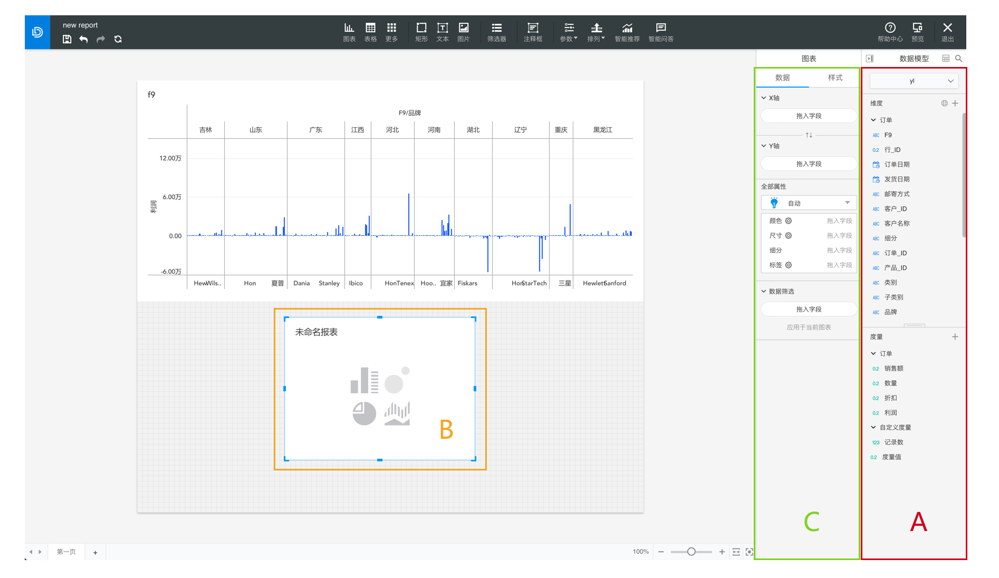
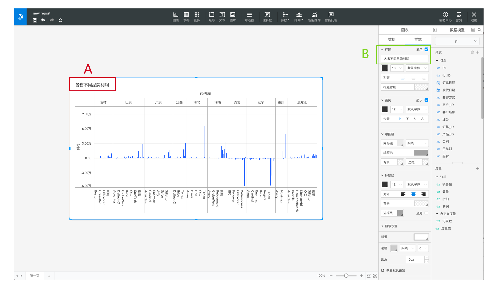

# 最好能所见即所得

用户期望得到的是所见即所得的操作。

即，完成了什么样的操作就得到怎样的结果；相对什么部分进行修改久立刻能在该处直接操作。

####例1：字段直接拖入画布进行绘制

当用户想用A区域中的字段绘制一张图表时，会：

1. 把A中的字段直接拖入图表区域B；
2. 把A中的字段拖入C区，以期在B中绘制图表；

比较以上2种方式，用户会更期望用怎样的方式进行操作呢？

相较于方法2的曲线完成操作，用户，尤其是非专业用户的心理预期都更倾向于方法1，直接将字段拖入绘图区域，然后得到结果，即所见即所得。

####例2：直接在画布上进行修改

当用户需要修改图表名称时，用户会期望用什么方式进行呢？

直接在图表上选择标题进行修改，还是跑去设置面板寻找“标题”栏？

很显然，对于用户而言，直接在图表上进行修改才是最直接、最直观的操作方式。