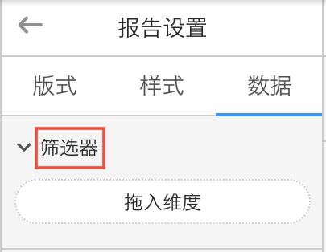

# 文案清晰明确

用户很忙，也很懒，不要期望他们会仔仔细细地看上百字的解释，他们甚至都不愿看十个字以上的长句。他们更希望看到区分明确、能一眼辨别清楚的词汇。

因此文案需要简单、清晰、明确。

####例1：简单

尽量不出现非常用词汇，或专业性过强的词汇。

例如：筛选器

除非专业用户，否则少有人知道“筛选器”其实就是用来筛选数据的。

那就在文案上直接告诉用户这是用来做“数据筛选”的，而不是故作玄虚取个专业名词:

####例2：清晰

用词清楚而不含糊，即使是相同的功能，在不同的位置所起到的作用也是不同的，那就在文案上直接告知用户，而不要使用相同的文案。

错误：

正确：

####例3：明确

若标题表述仍不够清楚，而空间又足够，则可以使用注释文字加强说明；

但切记简短：

