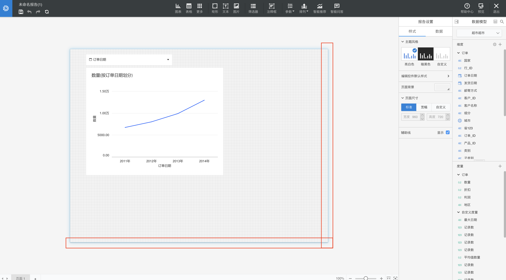
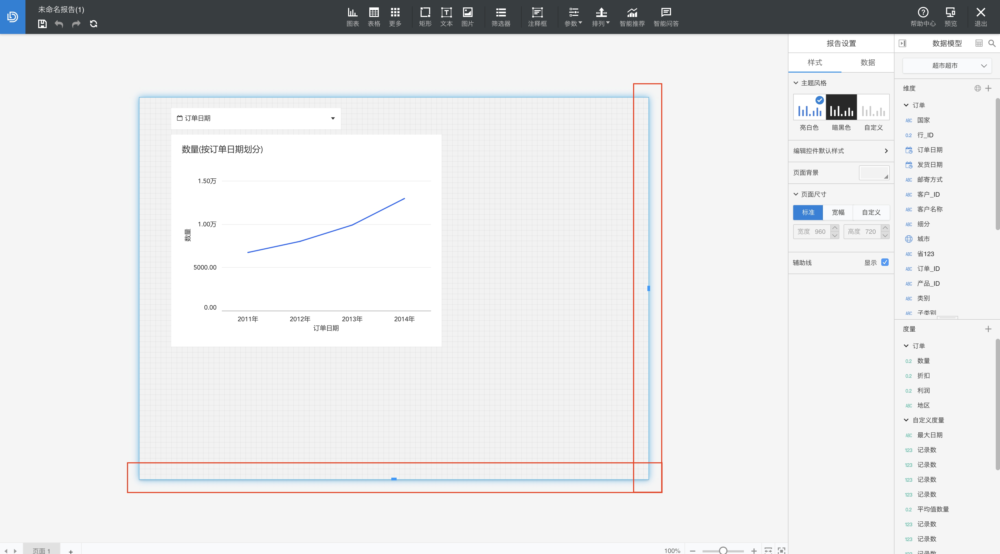

# 美观与实用需要平衡

对于任何一个有实用意义的产品而言，美观和实用都需要保持平衡。不能为了视觉上的美观而损失其实用性，进而影响用户的使用。

####例：调整画布

用户想要调整画布大小时，需要先将鼠标移至画布边缘，此时画布边缘会高亮及有光晕；点击边缘时，出现边框及可拖拽的提示：

但是可拖拽的提示只是很小的、位于边线中间的点，对于用户而言，也就不那么容易被发现了。此时，更友善的方法就是将可拖拽部分做的更明显，而不是为了保持美观而降低实用性。