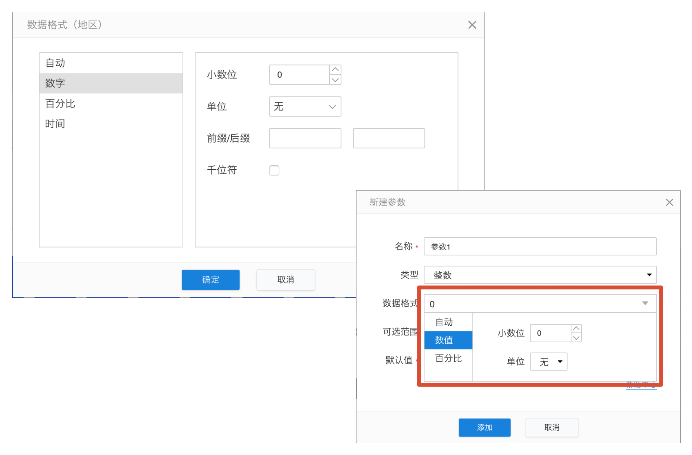

# 相同的内容使用一致的展示

相同的设置内容应该使用一致的展示方式，让用户能对设置内容抱有熟悉感，能更快地进行使用操作。

####例1：数据格式设置

数据格式设置在多处地方出现，例如针对度量字段的单独设置，又例如在新建或编辑参数时，也可以对参数进行数据格式的设置，那么在这些设置的地方就应该保持形式上的一致。

这样可以尽量避免用户对设置内容产生陌生感而误操作，也能保持整个产品的一致性从而使用户对产品产生认同。