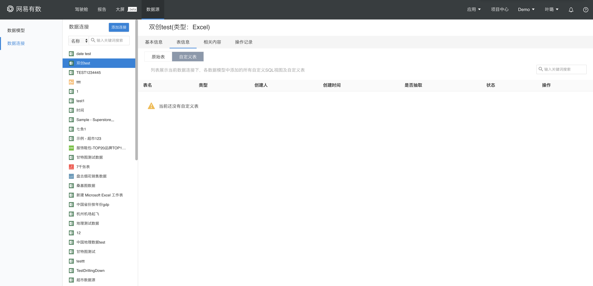

# 切忌出现空白页面

用户绝不期望看到空白的，毫无信息的页面，这会让用户产生迷惑及不信任感。用户会不知道发生了什么事，以及他们能继续做什么。

####例1：如果页面中确实没有可显示的信息，要给予提示

如图，若用户从未在数据模型中增加过自定义表，则该页面的列表确实为空。

但设计者应该考虑到这种情况，因此需要提供提示告知用户当下的状况：

####例2：移动端

由于横竖屏关系而导致的空白部分应该找到更合适的显方式，例如竖屏后，将图表自动置顶显示。