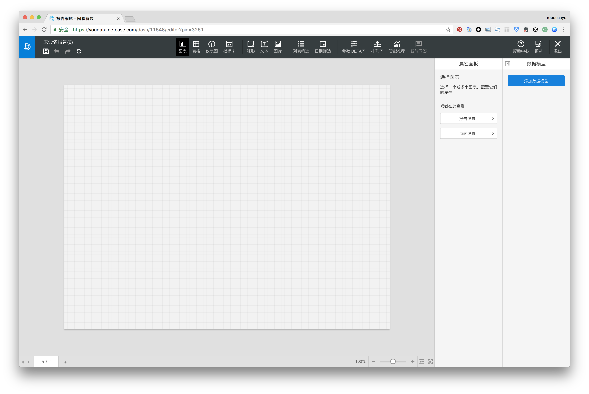
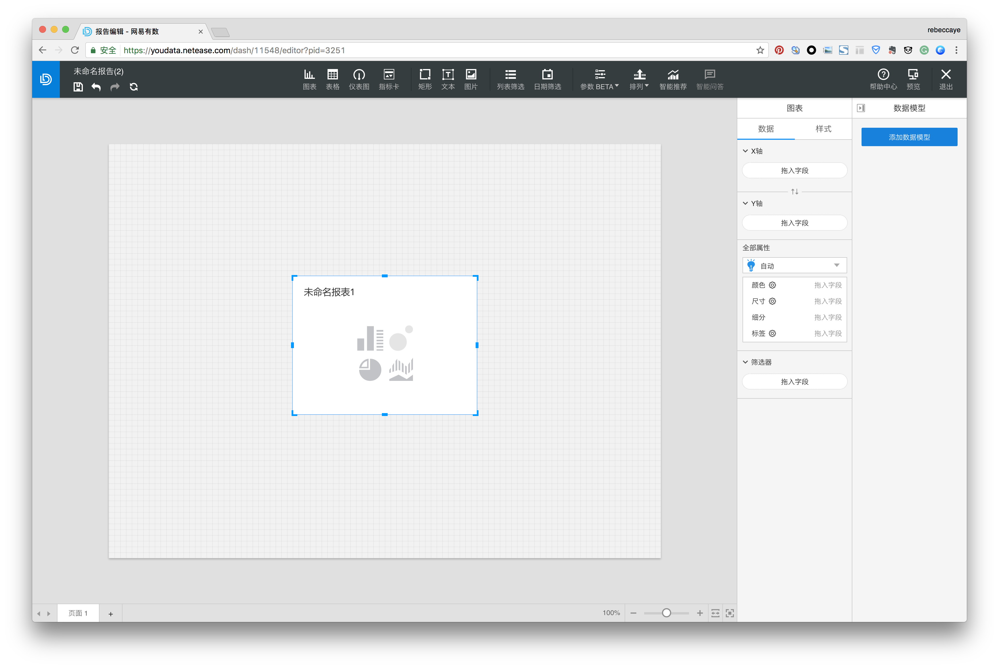
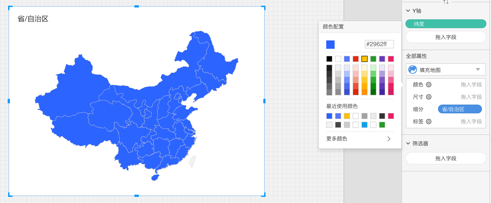

# 操作必有反馈

用户不喜欢模糊的、不明确的信息，他们更喜欢控制感，希望自己在每次操作后都能获得明确的反馈，而不是一无助的猜测结果。

用户需要在任何时候都知道自己的操作是成功还是失败，因此设计师必需及时给予用户明确的反应，以告知用户当前的位置、操作的结果，信息足够并且正向的情况下用户才会获得足够的控制感与满足感。

那么，如何及时的给予用户反馈呢？

####例1：

点击工具栏中的“图表”项时，用户会期望发生什么？

用户会期望有图表出现在画布上，而绝不是在点击选项后产品毫无反应。

####例2：

当用户在颜色面板中点击黄色时，他会期望得到什么结果？

是地图毫无变化？

还是地图从蓝色变为黄色？

