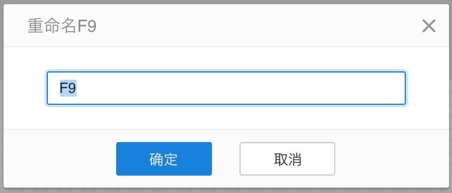
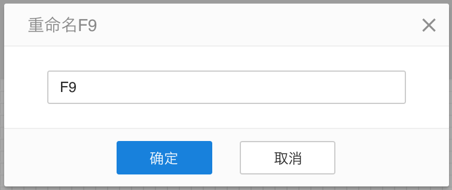
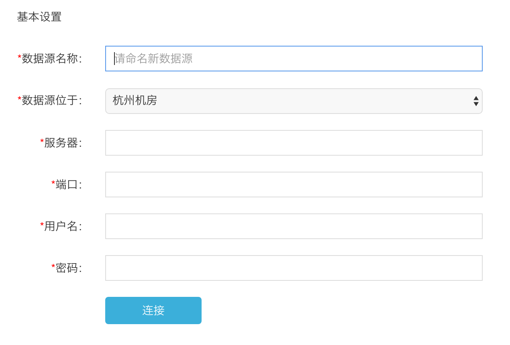
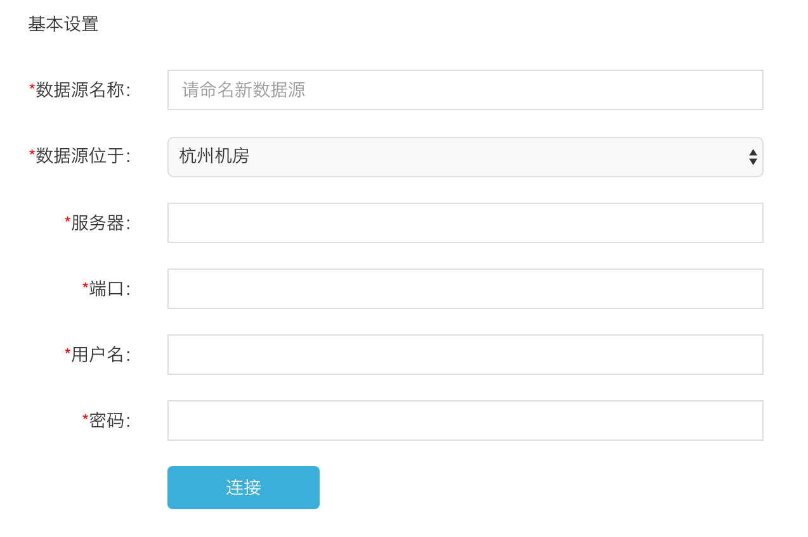

# 自动聚焦输入框

进入表单页面时，默认聚焦输入框；当表单为多行时，默认聚焦第一个需要输入的输入框。不要让用户再次双击才能继续输入的操作。

交互设计的基本原则，尽可能的减少用户不必要的操作。

当用户进入表单页面时，必然是希望输入内容的，那设计师就应该为用户考虑到这一点，提前聚焦需要输入的位置。

####例1：

打开单行表单时，自动聚焦：

而不要让用户多操作一步：

####例2：

打开多行表单时，自动聚焦需要输入的首行：

这其实也是对用户操作的引导，否则进入新页面时，用户未必清楚应该填哪些项。

而不要让用户多操作一步：

