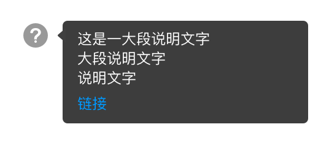

# 随时提供帮助

当用户在使用过程中遇到问题或疑虑时，产品应该能及时为用户提供帮助。

例如在不常用或不易理解的概念旁加     icon，hover时以Tooltip形式展示提示内容；

####例1：专业词汇

当产品中出现专业性较强的词汇或概念时：

若Tootltip仍不能解释清楚，则可以提供链接，点击后在新tab页进行更详细的介绍。

####例2：复杂功能

当产品中的某些功能较为复杂或高阶时，直接在复杂功能界面中提供详解页面的链接：

点击“帮助中心”后，新tab直接打开相应的计算字段介绍页面。
