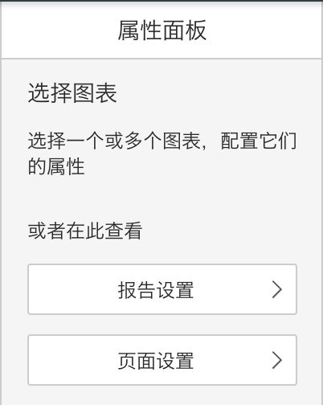
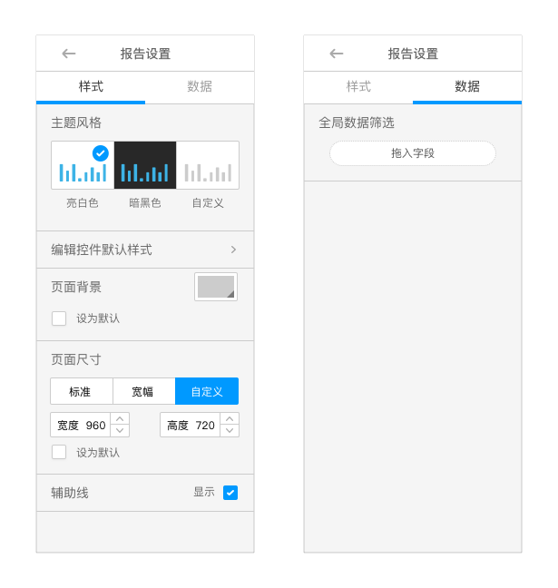

# 警惕过于逻辑

还是那句话，用户很忙。他们并不会愿意思考过多的逻辑问题，而更愿意跟随感觉。

有时候设计师过多的考虑到产品逻辑，反而为用户增添了麻烦，提高了理解和使用的成本。

####例1：

“‘报告’是什么？‘页面’又是什么？我只是想设个背景，为什么还要考验我的智商？”

“‘版式’？‘样式’？有什么区别？我要的设置项在哪儿？”

用户在遇到困难而又得不到帮助时，经常会直接产生退缩之意而放弃使用。

尽量减少不必要的概念和逻辑，把优先级最高的设置项放到第一层，让用户在需要时能立刻找到：

